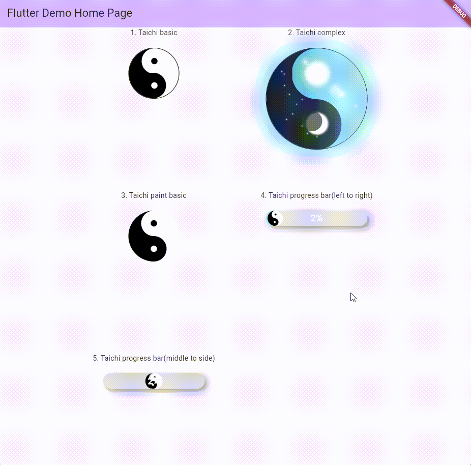

**`he` is `和` in Chinese, which means `peace` or `harmony`.**

[prewiew](https://guchengxi1994.github.io/he/)

| Type | Type | Type |
|----------|----------|----------|
| 1.basic | 2.complex | 3.basic(custom paint) |
| 4.progress bar(left to right) | 5.progress bar(middle to side) | |